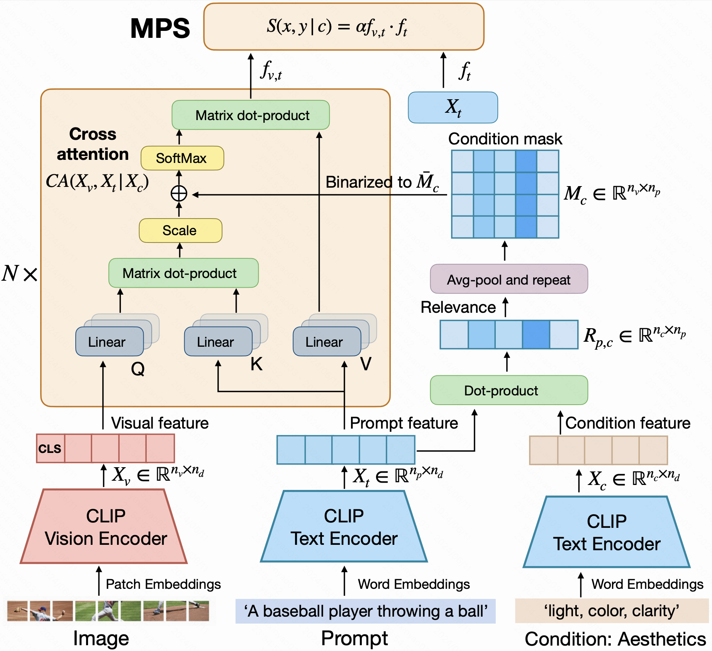

# Learning Multi-dimensional Human Preference for Text-to-Image Generation (CVPR 2024)
This repository contains the code and model for the paper [Learning Multi-dimensional Human Preference for Text-to-Image Generation](https://openaccess.thecvf.com/content/CVPR2024/papers/Zhang_Learning_Multi-Dimensional_Human_Preference_for_Text-to-Image_Generation_CVPR_2024_paper.pdf). 



## Installation
Create a virual env and download torch:

```bash
conda install pytorch torchvision torchaudio pytorch-cuda=11.8 -c pytorch -c nvidia
```

Install the requirements:
```bash
pip install -r requirements.txt
pip install -e .
```

## Inference with MPS
We display here an example for running inference with MPS:
```python
from io import BytesIO

from transformers import CLIPImageProcessor, AutoTokenizer
from PIL import Image
import torch

# load model
device = "cuda"
processor_name_or_path = "laion/CLIP-ViT-H-14-laion2B-s32B-b79K"
image_processor = CLIPImageProcessor.from_pretrained(processor_name_or_path)
tokenizer = AutoTokenizer.from_pretrained(processor_name_or_path, trust_remote_code=True)

model_ckpt_path = "outputs/MPS_overall_checkpoint.pth"
model = torch.load(model_ckpt_path)
model.eval().to(device)

def infer_example(images, prompt, condition, clip_model, clip_processor, tokenizer, device):
    def _process_image(image):
        if isinstance(image, dict):
            image = image["bytes"]
        if isinstance(image, bytes):
            image = Image.open(BytesIO(image))
        if isinstance(image, str):
            image = Image.open( image )
        image = image.convert("RGB")
        pixel_values = clip_processor(image, return_tensors="pt")["pixel_values"]
        return pixel_values
    
    def _tokenize(caption):
        input_ids = tokenizer(
            caption,
            max_length=tokenizer.model_max_length,
            padding="max_length",
            truncation=True,
            return_tensors="pt"
        ).input_ids
        return input_ids
    
    image_inputs = torch.concatenate([_process_image(images[0]).to(device), _process_image(images[1]).to(device)])
    text_inputs = _tokenize(prompt).to(device)
    condition_inputs = _tokenize(condition).to(device)

    with torch.no_grad():
        text_features, image_0_features, image_1_features = clip_model(text_inputs, image_inputs, condition_inputs)
        image_0_features = image_0_features / image_0_features.norm(dim=-1, keepdim=True)
        image_1_features = image_1_features / image_1_features.norm(dim=-1, keepdim=True)
        text_features = text_features / text_features.norm(dim=-1, keepdim=True)
        image_0_scores = clip_model.logit_scale.exp() * torch.diag(torch.einsum('bd,cd->bc', text_features, image_0_features))
        image_1_scores = clip_model.logit_scale.exp() * torch.diag(torch.einsum('bd,cd->bc', text_features, image_1_features))
        scores = torch.stack([image_0_scores, image_1_scores], dim=-1)
        probs = torch.softmax(scores, dim=-1)[0]

    return probs.cpu().tolist()

img_0, img_1 = "image1.jpg", "image2.jpg"
# infer the best image for the caption
prompt = "the caption of image" 

# condition for overall
condition = "light, color, clarity, tone, style, ambiance, artistry, shape, face, hair, hands, limbs, structure, instance, texture, quantity, attributes, position, number, location, word, things." 

print(infer_example([img_0, img_1], prompt, condition, model, image_processor, tokenizer, device))
```

## Download the MPS checkpoint
<table>
  <tr>
    <th rowspan="2" text-align="center">ID</th>
    <th colspan="4" text-align="center">Training Data</th>
    <th rowspan="2" text-align="center">MPS Model</th>
  </tr>
  <tr>
    <th text-align="center">Overall</th>
    <th text-align="center">Aesthetics</th>
    <th text-align="center">Alignment</th>
    <th text-align="center">Detail</th>
  </tr>
  <tr text-align="center">
    <td>&nbsp;1</td>
    <td>&nbsp;&nbsp;&nbsp;&nbsp;&#10003;</td>
    <td>&nbsp;&nbsp;&nbsp;&nbsp;&nbsp;&nbsp;&nbsp;&nbsp;-</td>
    <td>&nbsp;&nbsp;&nbsp;&nbsp;&nbsp;&nbsp;&nbsp;&nbsp;-</td>
    <td>&nbsp;&nbsp;&nbsp;&nbsp;-</td>
    <td>&nbsp;<a href="http://drive.google.com/file/d/17qrK_aJkVNM75ZEvMEePpLj6L867MLkN/view?usp=sharing">Model Link</a></td>
  </tr>
  <tr>
    <td>&nbsp;2</td>
    <td>&nbsp;&nbsp;&nbsp;&nbsp;&#10003;</td>
    <td>&nbsp;&nbsp;&nbsp;&nbsp;&nbsp;&nbsp;&nbsp;&nbsp;&#10003;</td>
    <td>&nbsp;&nbsp;&nbsp;&nbsp;&nbsp;&nbsp;&nbsp;&nbsp;&#10003;</td>
    <td>&nbsp;&nbsp;&nbsp;&nbsp;&#10003;</td>
    <td>&nbsp;&nbsp;&nbsp;&nbsp;&nbsp;&nbsp;&nbsp;&nbsp;-</td>
  </tr>
</table>

Due to the internal model approval process within the company, we only release MPS trained on overall preference, while MPS trained on multi human preferences will be open-sourced once it passes the approval process; however, there is a risk of delays and the possibility of force majeure events.
(Move the checkpoint file to `outputs/MPS_overall_checkpoint.pth`)


## Evaluation
Test MPS on ImageReward benchmark:

Please download the file, `datasets/test.json` to `imagereward/test.json` from [ImageReward](https://github.com/kekewind/ImageReward) and the related images from [ImageRewardDB](https://huggingface.co/datasets/THUDM/ImageRewardDB) as well.
```bash
 python eval_overall_mhp_on_imagereward.py
```
Test MPS on hpd_v2 benchmark:

Please download the annotation file, `test.json` to `hpdv2/test.json` and the related images(test dataset) from [HPDv2](https://huggingface.co/datasets/ymhao/HPDv2/tree/main).
```bash
 python eval_overall_mhp_on_hpdv2.py
```

## Results on different datasets
| ID  | Preference Model     | ImageReward | HPD v2 | MHP (Overall) |
|:-:|:-:|:-:|:-:|:-:|
| 1   | CLIP score           | 54.3        | 71.2   | 63.7          |
| 2   | Aesthetic Score      | 57.4        | 72.6   | 62.9          |
| 3   | ImageReward          | 65.1        | 70.6   | 67.5          |
| 4   | HPS                  | 61.2        | 73.1   | 65.5          |
| 5   | PickScore            | 62.9        | 79.8   | 69.5          |
| 6   | HPS v2               | 65.7        | 83.3   | 65.5          |
| 7   | **MPS (Ours)**           | **67.5**        | **83.5**   | **74.2**          |


## Citation
If you find this work useful, please cite:
```bibtex
@inproceedings{MPS,
  title={Learning Multi-dimensional Human Preference for Text-to-Image Generation},
  author={Zhang, Sixian and Wang, Bohan and Wu, Junqiang and Li, Yan and Gao, Tingting and Zhang, Di and Wang, Zhongyuan},
  booktitle={Proceedings of the IEEE/CVF Conference on Computer Vision and Pattern Recognition},
  pages={8018--8027},
  year={2024}
}
```

## Acknowledgments
We thank the authors of [ImageReward](https://github.com/kekewind/ImageReward), [HPS](https://github.com/tgxs002/align_sd), [HPS v2](https://github.com/tgxs002/HPSv2), and [PickScore](https://github.com/yuvalkirstain/PickScore) for their codes and papers, which greatly contributed to our work.
